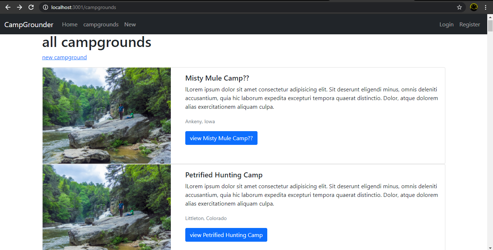
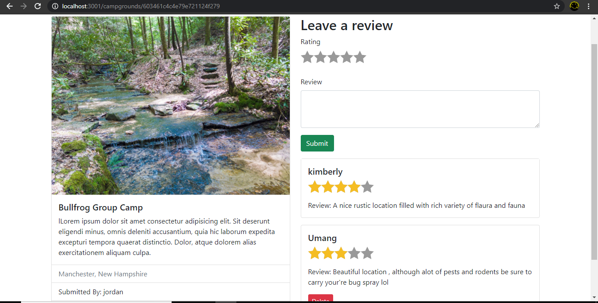

# CampGrounder

A Mini Project Created while learning full stack development

<h3>Some Features</h3>
<h4>Authentication</h4>
<ul>
<li>Users can sign up or login using username and password.</li>
<li>User can not submit campgrounds or edit and delete existing campgrounds if they are not logged in.</li>
  <li>Authentication for Client-side aswell as for Server-side </li>
  </ul>
<h4>Authorization</h4>
<ul>
 <li> User can only modify campgrounds created by them.</li>
  <li>Authorization for Client-side aswell as for Server-side </li>
  </ul>
  <h4>Basic Functionality</h4>
  <ul>
<li>  Add Name, Image and Description to the campground.</li>
<li>Create, Update, Delete, Edit the Campground.</li>
<li>Add comments,rating to campgrounds.</li>
<li>Flash Important messages to warn or greet the users.</li>
<li>Responsive Web design.</li>
  </ul>
  <h4>ScreenShots</h4>
  
  
